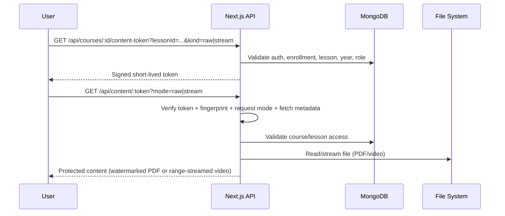

# LMS 0xRay

Production-grade Learning Management System (LMS) built with Next.js, TypeScript, MongoDB, and Docker.

This project includes:
- Role-based dashboards (admin, instructor, student)
- Course, lesson, enrollment, exam, and payment flows
- Secure PDF/video content delivery with tokenized access
- Upload pipeline for large media files
- Hardened webhook validation for Paymob payments
- Test, security, and smoke validation scripts

## 1. System Architecture

```mermaid
flowchart LR
  U[Browser Client] --> N[Nginx / Reverse Proxy]
  N --> A[Next.js App Container\n(lms-app)]
  A --> M[(MongoDB)]
  A --> F[(Uploads Volume\n/app/uploads)]
  A --> T[(Thumbnails Volume\n/app/public/thumbnails)]
  P[Paymob] --> W[/api/webhooks/paymob]
  W --> A
```

## 2. Content Protection Flow



## 3. Stack

- Frontend: Next.js 14 (App Router), React 18, Tailwind CSS
- Backend: Next.js API routes, TypeScript
- Database: MongoDB + Mongoose
- Auth: NextAuth
- Media:
  - PDF rendering: pdfjs-dist
  - Watermarking: pdf-lib
  - Video: secure stream mode with range support
- Payments: Paymob
- Testing: Vitest (unit + integration) + custom smoke/security scripts
- Deployment: Docker + Docker Compose

## 4. Key Security Controls

- Signed content tokens bound to user/session fingerprint/IP prefix
- Strict mode checks (`raw` vs `stream`) for content endpoints
- Fetch-Metadata-based request gating (`Sec-Fetch-*`)
- Path traversal and symlink protections for content file access
- Rate limits (token issuance, content access)
- PDF watermarking on served bytes
- Webhook HMAC verification and replay-safe processing
- Security headers (CSP, HSTS, X-Frame-Options, etc.)

## 5. Repository Layout

```text
src/
  app/
    api/
      auth/
      courses/
      content/
      enrollments/
      exams/
      payments/
      webhooks/
      admin/
      instructor/
      users/
    courses/
    dashboard/
    exams/
  components/
  contexts/
  lib/
  models/
  types/
tests/
scripts/
uploads/
public/
```

## 6. Prerequisites

- Node.js 20+
- npm 10+
- MongoDB 7+ (local or remote)
- Docker 24+ and Docker Compose v2+ (for containerized deployment)

## 7. Environment Variables

Create `.env.local` for local dev and `.env.docker` for Docker runtime.

### Required

- `MONGODB_URI`
- `NEXTAUTH_SECRET`
- `NEXTAUTH_URL`
- `CONTENT_SECRET`
- `PAYMOB_API_KEY`
- `PAYMOB_INTEGRATION_ID_CARD`
- `PAYMOB_INTEGRATION_ID_WALLET`
- `PAYMOB_INTEGRATION_ID_FAWRY`
- `PAYMOB_IFRAME_ID`
- `PAYMOB_HMAC_SECRET`

### Common Optional

- `RATE_LIMIT_MAX`
- `RATE_LIMIT_WINDOW_MS`
- `UPLOAD_DIR`
- `NODE_ENV`

## 8. Local Development

1. Install dependencies:

```bash
npm ci
```

2. Configure env:

```bash
cp .env.example .env.local
# edit values
```

3. Run dev server:

```bash
npm run dev
```

4. Open:

```text
http://localhost:3000
```

## 9. Build and Run (Node)

```bash
npm run build
npm run start
```

## 10. Docker Deployment

### 10.1 Build and Start

```bash
docker compose build lms
docker compose up -d lms
```

Service listens on `127.0.0.1:3001` by default (expected to be reverse-proxied by Nginx).

### 10.2 With Existing External Mongo Container

If your Mongo container already exists (for example `lms-mongo`):

1. Ensure `MONGODB_URI` in `.env.docker` points to that host, e.g.:

```env
MONGODB_URI=mongodb://lms-mongo:27017/lms_0xray
```

2. Connect Mongo container to the same compose network:

```bash
docker network connect lms_default lms-mongo
```

### 10.3 Health Checks

```bash
docker compose ps
docker inspect --format '{{.State.Health.Status}}' lms-app
```

## 11. Data and Persistent Volumes

- `./uploads -> /app/uploads`
  - `videos/`
  - `pdfs/`
  - `tmp/`
- `./public/thumbnails -> /app/public/thumbnails`

Back up these directories before major migrations.

## 12. Testing and QA

### 12.1 Lint

```bash
npm run lint
```

### 12.2 Unit Tests

```bash
npm run test
```

### 12.3 Integration Tests

```bash
npm run test:integration
```

### 12.4 Full Test Suite

```bash
npm run test:all
```

### 12.5 Paymob Security Checks

```bash
npm run test:paymob-security
```

### 12.6 Smoke Scripts

```bash
node test-v3.mjs
node test-clean.mjs
node test-all.mjs
```

## 13. API Overview

- Auth
  - `GET/POST /api/auth/*`
- Courses
  - `GET /api/courses`
  - `GET /api/courses/:id`
  - `PUT /api/courses/:id`
  - `POST /api/courses/:id/upload`
  - `GET /api/courses/:id/content-token`
- Content
  - `GET /api/content/:token?mode=raw|stream`
- Enrollment
  - `GET /api/enrollments`
- Exams
  - `GET/POST /api/exams`
  - `POST /api/exams/:id/start`
  - `POST /api/exams/submit`
- Payments
  - `POST /api/payments/initiate`
  - `POST /api/payments/exams/initiate`
- Webhooks
  - `POST /api/webhooks/paymob`

## 14. Behavior for Missing Uploaded Media

If a lesson is `video` or `pdf` but no file has been uploaded:

- Token endpoint returns `409` with clear message.
- Learn/preview UIs show a friendly fallback message instead of blank player/viewer.

This prevents confusing user experience and avoids broken content modal states.

## 15. Troubleshooting

### 15.1 `HTTP 409` when opening lesson content

Cause: media lesson has no uploaded file.

Fix: upload video/PDF for that lesson from instructor dashboard.

### 15.2 `MongooseServerSelectionError`

Cause: app cannot reach MongoDB host.

Fixes:
- Verify `MONGODB_URI`
- Ensure Mongo container/network DNS is reachable from app container
- Check firewall and container network attachment

### 15.3 Direct content URL returns 403

Expected by design. Content is tokenized and request-gated; use course flow to access content.

## 16. Operational Checklist

- Pull latest code
- Verify env file
- Build and restart container
- Confirm health status is `healthy`
- Run smoke checks
- Validate login, course open, content preview, payment initiation

## 17. Security and Review Docs

For deeper review artifacts, see:

- `SECURITY_AUDIT.md`
- `docs/SECURITY_REVIEW.md`
- `docs/FULL_CODE_REVIEW.md`
- `docs/TEST_PLAN.md`

## 18. License

Private project. All rights reserved unless explicitly stated otherwise.
